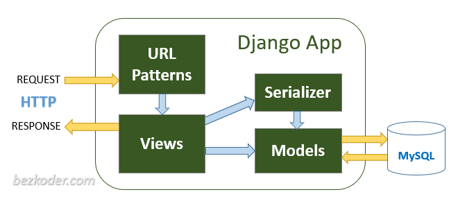
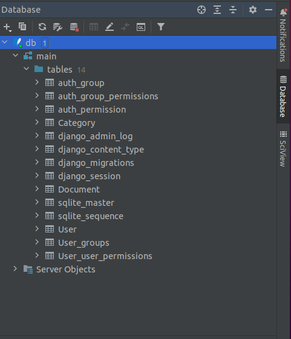

# DocumentManagementSystem

## Django rest api flow
The Image bellow demonstrate how a simple Django_rest_framework work

We can easily see that we need to create/define 
- Url patterns for our application
- View for request processing
- Serialiser to convert any model to serialized JSON objects
- Model to specify our model such as Document, User, Category,...
## Instruction
### Installation
 - Django, Django_rest_framework and rest_framework_simplejwt(to using jwt authentication, see https://django-rest-framework-simplejwt.readthedocs.io/en/latest/)
```
pip3 install django
pip3 install djangorestframework
pip3 install rest_framework_simplejwt
```
 - DB mirgration
```
python3 manage.py makemigrations
python3 manage.py migrate
```
 -  Running
```
python3 manage.py runserver
```
### How it works
#### 1. Add Django Rest framwork and a few stuff to src/settings.py
``` 
INSTALLED_APPS = [
    ...
    # Django REST framework 
    'rest_framework',
    'djoser'
    "Document"
]

    TEMPLATES = [
        {
                 "BACKEND": "django.template.backends.django
                 DjangoTemplates",
                "DIRS": [os.path.join(BASE_DIR, 'build')],
                "APP_DIRS": True,
                "OPTIONS": {
            "context_processors": []
        }
    ]
EMAIL_BACKEND = 'django.core.mail.backends.smtp.EmailBackEnd'
EMAIL_HOST = 'stmp.gmail.com'
EMAIL_PORT = 587
EMAIL_HOST_USER = 'ISODS@isods.org'
EMAIL_HOST_PASSWORD = 'randomPassword' //
EMAI_USE_TLS = True
```
If you don't see the app password in security section (manage your Gmail account)
Take a look at this link  https://myaccount.google.com/apppasswords "Sign-in by Gmail of ISODS organization"
This link will generate a passowrd, copy that to randomPassword above.
```
    STATICFILES_DIRS = [
    os.path.join(BASE_DIR, 'build/static')
]

STATIC_ROOT = os.path.join(BASE_DIR, 'static')

REST_FRAMEWORK = {
    'DEFAULT_AUTHENTICATION_CLASSES': (
        'rest_framework.authentication.TokenAuthentication',
    ),
}

SIMPLE_JWT = {
    'AUTH_HEADER_TYPES': ('JWT',),
}

DJOSER = {
    'LOGIN_FIELD': 'email',
    'USER_CREATE_PASSWORD_RETYPE': True,
    'USER_CHANGED_EMAIL_CONFIRMATION': True,
    'PASSWORD_CHANGED_EMAIL_CONFIRMATION': True,
    'SEND_CONFIRMATION_EMAIL': True,
    'SET_USERNAME_RETYPE': True,
    'SET_PASSWORD_RETYPE': True,
    'PASSWORD_RESET_CONFIRM_URL': 'password/reset/confirm/{uid}/{token}',
    'USERNAME_RESET_CONFIRM_URL': 'email/reset/confirm/{uid}/{token}',
    'ACTIVATION_URL': 'activate/{uid}/{token}',
    'SEND_ACTIVATION_EMAIL': True,
    'SERIALIZERS': {
        'user_create': 'Document.serialisers.UserSerializer',
        'user': 'Document.serialisers.UserSerializer',
        'user_delete': 'djoser.serialisers.UserDeleteSerializer'
    }
}
```

#### 2. Use default db (mysqlite)

#### 3. Create Document model(Document/models.py)
```python
class Document(models.Model):
    docs_id = models.CharField(max_length=50)
    category_id = models.CharField(max_length=20)
    brief = models.CharField(max_length=50)
    content = models.CharField(max_length=500)
    media_file = models.CharField(max_length=200)
    author = models.CharField(max_length=100)
    created_date = models.DateTimeField()
    def __str__(self):
        return self.docs_id

    class Meta:
        #specify table name
        db_table = 'Document'  
```
#### 4. Create Serialiser(Document/serialiser.py)
```python
class DocumentSerializer(serializers.ModelSerializer):
    class Meta:
        model = Document
        fields = ('docs_id', 'category_id', 'brief', 'content', 'media_file', 'author', 'created_date')
```

#### 5. Create View(Document/views.py)
1.1 Create Document
```python
class ListCreateDocumentView(ListCreateAPIView):
    model = Document
    serializer_class = DocumentSerializer
    #get all
    def get_queryset(self):
        return Document.objects.all()
    #create
    def create(self, request, *args, **kwargs):
        serializer = DocumentSerializer(data=request.data)

        if serializer.is_valid():
            serializer.save()

            return JsonResponse({
                'message': 'Create a new Document successful!'
            }, status=status.HTTP_201_CREATED)

        return JsonResponse({
            'message': 'Create a new Document unsuccessful!'
        }, status=status.HTTP_400_BAD_REQUEST)
```

1.2 Update Document
```python
class UpdateDeleteDocumentView(RetrieveUpdateDestroyAPIView):
    model = Document
    serializer_class = DocumentSerializer
    #update
    def put(self, request, *args, **kwargs):
        document = get_object_or_404(Document, id=kwargs.get('pk'))
        serializer = DocumentSerializer(post, data=request.data)

        if serializer.is_valid():
            serializer.save()

            return JsonResponse({
                'message': 'Update Document successful!'
            }, status=status.HTTP_200_OK)

        return JsonResponse({
            'message': 'Update Document unsuccessful!'
        }, status=status.HTTP_400_BAD_REQUEST)
    #delete
    def delete(self, request, *args, **kwargs):
        document = get_object_or_404(Document, id=kwargs.get('pk'))
        document.delete()

        return JsonResponse({
            'message': 'Delete Document successful!'
        }, status=status.HTTP_200_OK)
```

#### 5. Specify URL
```python
#document url
#Document/urls.py
urlpatterns = [
    path('documents', views.ListCreateDocumentView.as_view()),
    path('documents/<int:pk>', views.UpdateDeleteDocumentView.as_view()),
]
```
```python
#base url
#src/urls.py
urlpatterns = [
    path("admin/", admin.site.urls),
    path('api/', include('Document.urls'))
]
```
#### 6. Migration to DB
```
python3 manage.py makemigrations
python3 manage.py migrate

```

#### 7. Running
```
python3 manage.py runserver
```
command will show
```
Watching for file changes with StatReloader
Performing system checks...

System check identified no issues (0 silenced).
March 21, 2023 - 18:34:20
Django version 4.1.7, using settings 'src.settings'
Starting development server at http://127.0.0.1:8000/
Quit the server with CONTROL-C.

```
#### 8. Testing
`http://127.0.0.1:8000/api/documents`
You can use postman to test it easily or open with your browser

#### 9. Open DB using pycharm
- Double-click db.sqlite3
- DB tab will show like this image

